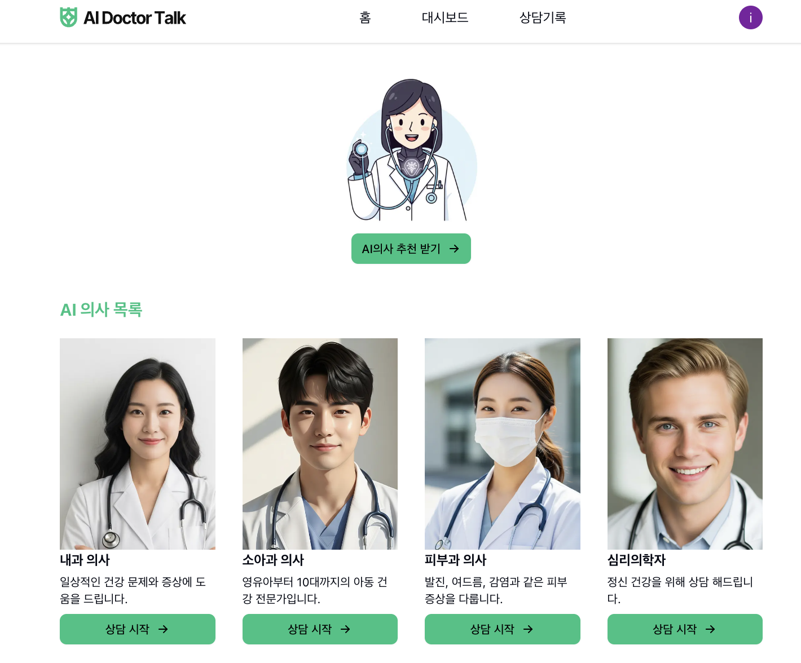
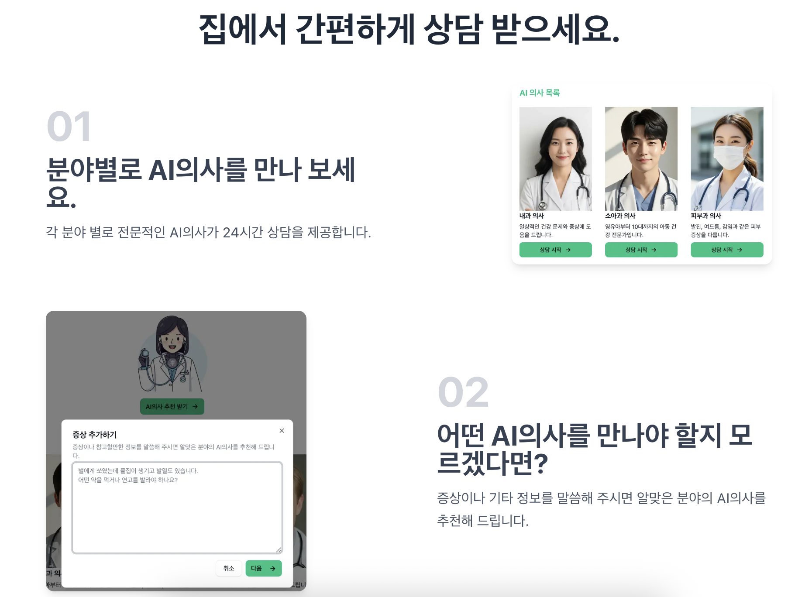
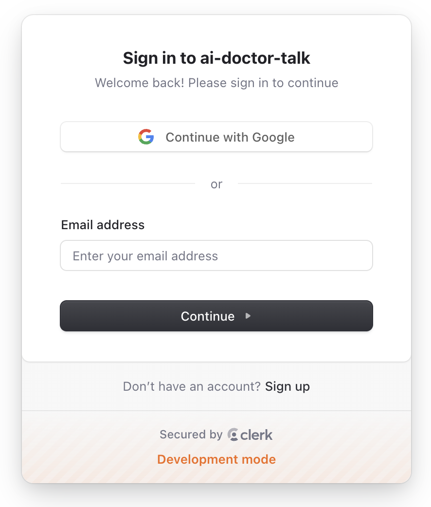
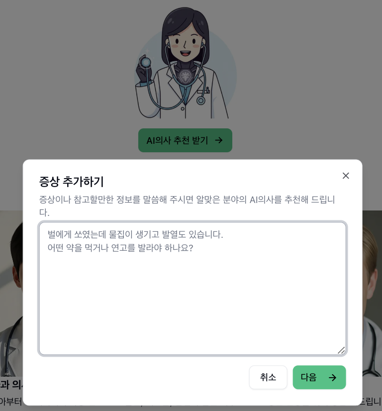
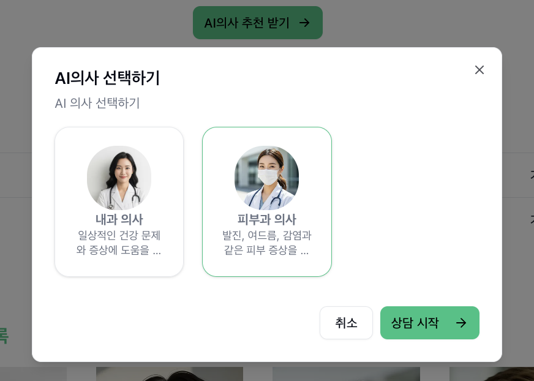
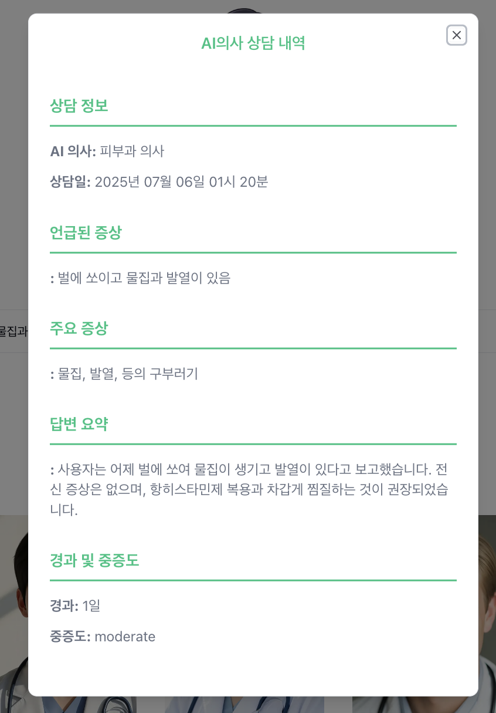
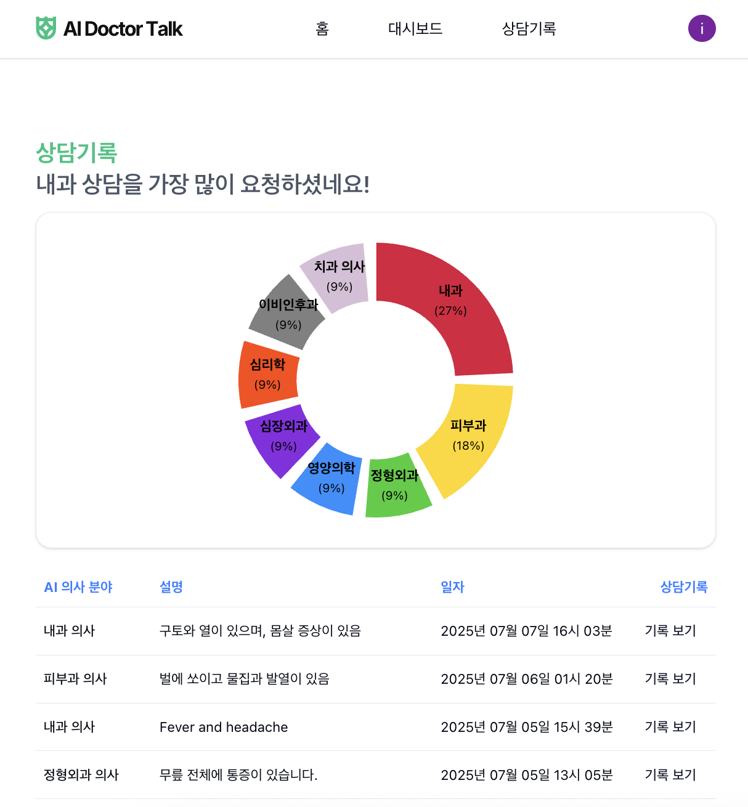

# 🩺 AI 닥터톡 (AI Doctor Talk) - 24시간 음성대화 AI 건강 상담 서비스



<br>
<br>

## 🌟 프로젝트 Demo

비용 문제로 Demo는 공개하지 않으니 필요하시면 이메일을 주세요.
Vapi.ai 이용으로 1분당 비용이 발생합니다.
: 1129whk@gmail.com

<br>

## 🌟 프로젝트 소개



<br>

'AI 닥터톡'은 사용자가 24시간 언제든 AI 의사와 음성으로 대화하며 건강 상담을 받을 수 있도록 설계된 웹 서비스입니다.

간단한 건강에 대한 궁금증, 병원 방문이 어려운 시간대, 혹은 사소한 증상에 대한 고민이 있을 때, 'AI 닥터톡'은 사용자에게 즉각적이면서 맞춤형 AI 기반 건강 조언을 해드립니다.

<br>

## ✨ 주요 기능 및 화면


<br>

- **📈 대시보드:** 사용자 친화적인 간단한 UI로 AI의사 목록 및 AI 추천받기를 할 수 있는 페이지입니다.

<br>



<br>

- **🔒 사용자 인증:** Clerk을 통해 안전하고 간편한 사용자 로그인 및 회원가입 기능을 제공하며, 구글 간단로그인 또는 새 계정 생성을 선택할 수 있습니다. 일정 시간 사이트 사용이 없을 시 자동 로그아웃 됩니다.

<br>



<br>



<br>

- **🧑‍⚕️ 맞춤형 AI 의사 추천:** 사용자가 입력한 증상 정보를 기반으로 **DeepSeek** AI모델이 AI 의사를 추천해주는 기능을 포함합니다.(AI모델은 변경 가능)

<br>


<br>

- **🧠 AI 의사와 상담:** OpenAI API(ChatGpt-4.1/AI모델은 변경 가능)를 통해 LLM(거대 언어 모델)을 활용하여 사용자의 증상과 질문을 이해하고 신뢰성 있는 건강 정보를 제공합니다.

- **🎙️ 실시간 음성대화:** Vapi Voice Provider(google gemini를 transcriptor로 포함)를 활용하여 사용자와 AI의사 간의 자연스러운 음성 대화가 가능합니다.

<br>



<br>



<br>

- **📄 상담 내용 기록 및 요약:** 상담 후 대화 내용이 보고서에 기록되며, 사용자는 그래프와 함께 보고서 목록을 볼 수 있습니다.

<br>

## 🚀 기술 스택

- **프론트엔드:**
  - `Next.js` (React 기반 풀스택 프레임워크)
  - `React` (UI 개발 라이브러리)
  - `TypeScript` (자바스크립트에 타입 검사 기능을 더한 언어)
  - `Shadcn UI` (재사용 가능한 고품질 UI 컴포넌트)
  - `Framer Motion` (애니메이션 라이브러리)
  - `Recharts` (차트 라이브러리)
  - `Moment.js` (날짜/시간 처리 라이브러리)

<br>
  
- **백엔드 & AI/음성 연동:**
  - `Vapi.ai` (실시간 음성 AI 대화)
  - `OpenRouter.ai` (다양한 LLM 통합 인터페이스)
  - `OpenAI API` (LLM 기반 대화 및 응답 생성)
  - `axios` (HTTP 통신 라이브러리)

<br>

- **인증:**

  - `Clerk` (사용자 인증 및 관리 서비스)

<br>

- **데이터베이스:**

  - `Neon` (서버리스 PostgreSQL 데이터베이스)
  - `Drizzle ORM` & `Drizzle Kit` (TypeScript 코드를 이용하여 데이터베이스와 상호작용하게 도와주는 도구)

<br>
<br>

## 🚀 핵심 AI 기술

'AI 닥터톡'은 다음과 같은 AI 기술들을 유기적으로 결합하여, 비용을 절감하면서도 사용자에게 자연스러운 대화 경험을 제공합니다.

AI 모델은 'DeepSeek, Google Gemini, ChatGpt'를 혼합하여 사용하였습니다.

- **STT (Speech-to-Text) - 음성-텍스트 변환:**

  - **설명:** 사용자의 음성을 AI가 이해할 수 있는 텍스트로 변환하는 기술.
  - **AI 닥터톡에서 활용:** 사용자가 AI 의사에게 말을 할 때, Vapi.ai 내부적으로 Google Gemini를 trascriptor로 사용하여 사용자의 음성을 텍스트로 변환하고, 이를 LLM이 이해할 수 있도록 전달합니다.

- **LLM (Large Language Model) - 거대 언어 모델:**

  - **설명:** 방대한 텍스트 데이터를 학습하여 사람처럼 언어를 이해하고, 새로운 텍스트를 생성하는 인공지능 모델.
  - **AI 닥터톡에서 활용:** 'AI 닥터톡'의 핵심 '두뇌' 역할을 합니다. OpenRouter.ai를 통해 연결된 OpenAI(GPT-4.1 모델) LLM이 STT로 변환된 사용자의 질문을 이해하고, 의료 지식을 바탕으로 적절한 답변을 생성합니다. 또한, DeepSeek를 통하여 사용자의 증상에 맞는 AI 의사를 추천하는 데도 활용됩니다.

- **TTS (Text-to-Speech) - 텍스트-음성 변환:**
  - **설명:** AI의사의 텍스트를 사람의 음성으로 변환하는 기술.
  - **AI 닥터톡에서 활용:** Vapi.ai를 통해 이루어져, 사용자가 AI 의사와 실제 통화하는 듯한 경험을 제공합니다.

<br>

## 🛠️ 개발 환경 설정

이 프로젝트를 로컬 환경에서 실행하려면 다음 단계를 따라주세요.

### 1. 전제 조건

- `Git` (소스 코드 클론을 위해 필요)
- `Node.js` (최신 버전 권장)
- `npm` 또는 `Yarn` (패키지 관리자)

### 2. 프로젝트 클론

```
git clone [프로젝트_레포지토리_URL]
cd ai-doctor-talk
```

### 3. 종속성 설치

```
npm install
# 또는
yarn install
```

### 4. 환경 변수 설정

프로젝트 루트 디렉토리에 .env 파일을 생성하고 다음 환경 변수를 설정합니다. 각 서비스에서 API 키를 발급받아야 합니다.
<>부분에 API 키를 입력하면 되며 <>는 필요가 없습니다.

```
#Neon 데이터베이스와 연결
DATABASE_URL=<connection string>

#Clerk API keys
NEXT_PUBLIC_CLERK_PUBLISHABLE_KEY=<Clerk API keys>

NEXT_PUBLIC_CLERK_SIGN_IN_URL=/sign-in
NEXT_PUBLIC_CLERK_SIGN_IN_FALLBACK_REDIRECT_URL=/
NEXT_PUBLIC_CLERK_SIGN_UP_FALLBACK_REDIRECT_URL=/

NEXT_PUBLIC_CLERK_SIGN_UP_URL=/sign-up
NEXT_PUBLIC_CLERK_SIGN_UP_FALLBACK_REDIRECT_URL=/
NEXT_PUBLIC_CLERK_SIGN_IN_FALLBACK_REDIRECT_URL=/

#OpenRouter API Key
#deepseek/deepseek-chat-v3-0324:free  (AI모델 변경 가능)
OPEN_ROUTER_API_KEY=<OpenRouter API Key>

#VAPI 음성AI 부분
NEXT_PUBLIC_VAPI_VOICE_ASSISTANT_ID=<YOUR_PUBLIC_API_KEY>
NEXT_PUBLIC_VAPI_API_KEY=<Public API Keys>
```

- NEXT_PUBLIC_CLERK_PUBLISHABLE_KEY, CLERK_SECRET_KEY: Clerk 웹사이트에서 발급받습니다.

- DATABASE_URL: Neon 웹사이트에서 Connection String을 복사하여 붙여넣습니다.

- NEXT_PUBLIC_VAPI_API_KEY, NEXT_PUBLIC_VAPI_VOICE_ASSISTANT_ID: Vapi.ai 웹사이트에서 발급받습니다. 어시스턴트 ID는 생성된 AI 의사 어시스턴트의 ID입니다.

- OPEN_ROUTER_API_KEY: OpenRouter.ai 웹사이트에서 API 키를 발급받습니다.

### 5. 데이터베이스 마이그레이션

Drizzle ORM 스키마를 데이터베이스에 적용하는 방법.

```
npx drizzle-kit push

npx drizzle-kit studio
```

'npx drizzle-kit studio' 명령어를 실행하면, 데이터베이스 내용을
<https://local.drizzle.studio> 주소에서 웹 인터페이스로 확인할 수 있습니다.

### 6. 개발 서버 실행

```
npm run dev
# 또는
yarn dev
```

이제 http://localhost:3000 에서 AI 닥터톡 서비스를 확인할 수 있습니다.
